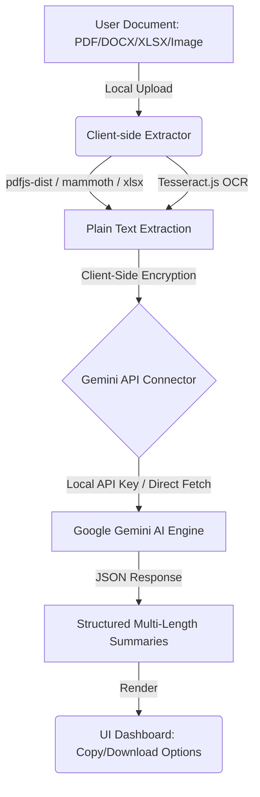

# Summariz — Client-Side Document Summarization Assistant

[](https://react.dev/)
[](https://vite.dev/)
[](https://tailwindcss.com/)
[](https://www.typescriptlang.org/)
[](https://ai.google.dev/)
[](https://aistudio.google.com/)

Summariz is a high-performance, security-focused web application designed to extract content and generate structured, context-aware summaries from complex business documents and scanned images. By utilizing client-side parsers and localized Optical Character Recognition (OCR), all raw data processing is contained entirely within the user's web browser, maintaining absolute data privacy and governance.

---

## Codebase Architecture

```
Summify/
├── public/                     # Static assets (logos, fallback images)
├── src/
│   ├── app/
│   │   ├── components/
│   │   │   ├── figma/          # Figma design helper utilities
│   │   │   └── ui/             # Reusable Shadcn UI component primitives
│   │   └── App.tsx             # Main layout, application state, & orchestration
│   ├── services/
│   │   ├── docxExtractor.ts    # DOCX local parsing engine via Mammoth.js
│   │   ├── geminiService.ts    # Google Gemini API connector (JSON Schema validation)
│   │   ├── ocrExtractor.ts     # Scanned image OCR engine via Tesseract.js
│   │   ├── pdfExtractor.ts     # Client-side PDF page rendering & text extraction
│   │   └── xlsxExtractor.ts    # Spreadsheet cell parser via sheetJS (xlsx)
│   ├── styles/                 # Custom styling tokens, themes, & variables
│   ├── types/                  # Shared TypeScript interface definitions
│   └── main.tsx                # Application bootstrap and react tree initialization
├── .env                        # Local development environment configuration
├── package.json                # Project dependencies and script runner configurations
└── vite.config.ts              # Vite bundling, plugins, and path mapping config
```

---

## 1. Setup & Installation Guide

Follow the procedure below to configure and run the application in a local environment.

### System Prerequisites
Ensure that the following runtimes are installed on your host system:
* **Node.js**: Version 18.0.0 or higher
* **Package Manager**: npm (v9+), yarn (v1.22+), or pnpm (v8+)

### Step-by-Step Configuration

1. **Clone the Repository:**
   ```bash
   git clone <repository-url>
   cd Summify
   ```

2. **Install Node Dependencies:**
   ```bash
   npm install
   ```

3. **Configure Environment Variables:**
   Create a `.env` configuration file in the root directory (parallel to `package.json`) to register your API key:
   ```env
   # Google Gemini API Key
   # Obtain a free developer key from https://aistudio.google.com/
   VITE_GEMINI_API_KEY=your_gemini_api_key_here
   ```
   *Note: If the `VITE_GEMINI_API_KEY` is omitted from the `.env` file, the application remains fully functional. Users will be prompted to securely input their API key via the settings modal within the application UI (stored locally in `window.localStorage`).*

4. **Start the Local Development Server:**
   ```bash
   npm run dev
   ```

5. **Access the Application:**
   Open a web browser and navigate to the local address output by Vite:
   [http://localhost:5173/](http://localhost:5173/)

---

## 2. Problem Statement

Corporate environments, academic institutions, and legal teams process massive quantities of unstructured text across disparate file formats every day. Manually reviewing long-form PDFs, complex spreadsheets, and scanned documents is highly labor-intensive, leading to significant drops in operational efficiency.

While cloud-based AI summarization utilities exist, they present substantial corporate risks:
* **Data Leakage & Governance Violations**: Uploading confidential contracts, medical records, or proprietary financial projections to third-party servers raises compliance concerns (e.g., GDPR, HIPAA, SOC 2).
* **Format Limitations**: Standard summarizers typically only ingest plain text or native PDFs, failing when encountering spreadsheets (`.xlsx`) or scanned image formats.
* **Cost Inefficiencies**: Traditional services lock users behind expensive monthly subscription tiers with arbitrary file-size limitations.

---

## 3. The Summify Solution

Summify bridges the gap between high-level intelligence and strict data privacy protocols.



By decoupling text parsing from the AI inference engine, Summify processes files using **client-side sandboxed execution**. Files are parsed inside the local browser thread using WebAssembly and Web Workers. The raw documents are never uploaded to any backend database. Once parsed, only the structured text contents are transmitted via secure HTTPS directly to Google Gemini’s endpoints using the user's localized API key.

---

## 4. Feature Architecture

Summify provides a robust feature set optimized for professional workflows:

* **Universal Document Ingestion**: Native client-side support for:
  * **Portable Document Format** (`.pdf`)
  * **Microsoft Word** (`.docx`)
  * **Microsoft Excel** (`.xlsx`)
  * **Structured Tables** (`.csv`)
  * **Scanned Images** (`.png`, `.jpg`, `.jpeg`)
  * **Plain Text Markup** (`.txt`, `.md`, `.json`)
* **Local WebAssembly OCR**: Background text extraction from scanned forms, diagram screenshots, or printed reports utilizing `Tesseract.js`.
* **Dynamic Summary Depth Controls**: Instantly switch between three pre-configured granularities without re-extracting text:
  * **Executive Recap (Short)**: A concise, single-sentence summary targeting immediate core takeaways.
  * **Synopsis (Medium)**: A structured 1-to-2 paragraph breakdown highlighting primary arguments.
  * **Analytical Report (Long)**: An in-depth, multi-paragraph analysis detailing data points and conclusions.
* **Key Takeaway Matrix**: Automatically extracts and parses core action items and structural conclusions into a clean, bulleted checklist.
* **Export Utilities**: One-click copy-to-clipboard functionality and download modules to save generated summaries as formatted plain-text files (`.txt`).
* **Interactive Pipeline Feedback**: Visual step indicators detailing document ingestion states (parsing, OCR extraction, analytical processing, and summary generation).
* **Secure API Storage**: Built-in API configuration modal enabling secure key management, persisted directly inside `window.localStorage`.

---

## 5. Technology Stack & Rationale

| Dependency | Purpose | Rationale |
| :--- | :--- | :--- |
| **React 18.3 & TypeScript** | Component Framework | Provides a component-driven architecture with strict compile-time type-safety. |
| **Vite 6.0** | Build Toolchain | Delivers near-instantaneous hot reloading and highly optimized assets bundling. |
| **Tailwind CSS v4 & Shadcn** | Styling & UI Primitives | Custom CSS tokens paired with highly accessible, clean structural primitives. |
| **pdfjs-dist** | Local PDF Extraction | Decodes PDF binary formats and extracts text streams entirely inside the browser. |
| **Mammoth.js** | Local DOCX Parsing | Converts Word XML structures directly to text, preventing server-side rendering overhead. |
| **SheetJS (xlsx)** | Local Excel Processing | Reads complex worksheets, row data, and formula cells without external dependencies. |
| **Tesseract.js** | Client-Side OCR | Performs local optical character recognition in browser Web Workers using compiled WebAssembly. |
| **Motion** | Fluid Micro-Animations | Controls state-based canvas rendering, progress tracking, and keyframe transitions. |
| **Gemini 3.6 Flash** | Generative AI Inference | Delivers highly accurate summaries, fast response speeds, and strict JSON schema enforcement. |

---

## 6. Differentiator Matrix

| Feature / Metric | Cloud-Based SaaS Tools (e.g., ChatPDF) | Summify |
| :--- | :--- | :--- |
| **File Storage Location** | Remote Third-Party Servers | **100% Local Browser Memory** |
| **Privacy Compliance** | High Risk (Subject to Data Brokerage) | **Zero Leakage (GDPR / SOC 2 Ready)** |
| **Scanned Document Support** | Often requires paid premium plans | **Integrated local OCR (Free/Unlimited)** |
| **Excel Spreadsheet Support** | Poor or unsupported | **Robust cell parser integration** |
| **Pricing Model** | Recurring monthly subscription fees | **Free Tier Dev API (Pay-as-you-go)** |
| **Data Retention** | Permanent or 30-day retention policies | **None (Data ceases to exist on browser close)** |

---

## 7. UI/UX Figma Design Integrity

Summify is engineered to preserve the stylistic and functional decisions of its original Figma design:
* **Color System**: Employs an ultra-modern color scheme with rich emerald accent colors (`#00c853` / `#00b853`), deep charcoal elements (`#0c140e`), and soft slate backgrounds (`bg-muted/30`) that provide high visual comfort.
* **Layout Design**: A minimalist navigation structure and unified interactive dashboard prevent cognitive overload.
* **Micro-Animations**: Uses framer-motion keyframes for tab selections, progress fills, error dialog expansions, and a pulsing live status indicator to make the system feel active and responsive.
* **Trust Elements**: Utilizes clear, high-contrast visual badges (e.g., `🔒 ZERO DATA STORED`, `📄 PDF / WORD / TXT`) to provide instant security reassurance.

---

## 8. Strategic Product Roadmap

* **YouTube Video Link Summarizer**: Implement transcript fetching modules via secure proxy endpoints, enabling Gemini to synthesize long-form video lectures and conference calls.
* **Interactive Document Chatbot (Local RAG)**: Build a local Retrieval-Augmented Generation panel allowing users to query document contents interactively in real-time.
* **Multilingual Translation**: Support direct localization of summaries into 15+ international languages.
* **Offline AI Processing**: Provide support for local LLMs (e.g., Llama 3 via Ollama) to allow completely offline summarization workloads.

---

## 9. Security & Compliance

Summify does not act as an intermediary for user data:
* **No Database Logging**: No server databases are maintained by this application.
* **Secure API Key Custody**: API Keys are kept within your browser's private application storage. They are never sent to any intermediary server and are dispatched solely to Google's official Gemini endpoint.
* **Secure Transit**: All communications with the Google Gemini API are encrypted in transit via Transport Layer Security (TLS 1.3).

---

## 10. License

This project is licensed under the MIT License. See the LICENSE file for details.